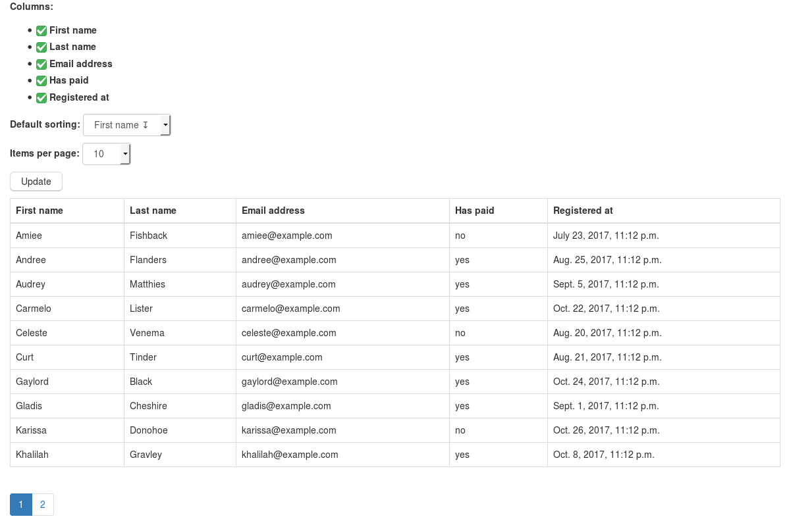

# django-configurable-tables

Status: **Work In Progress**

Configurable (filterable, sortable, paginatable) HTML table support in Django



## Run the example application

`docker build -t django-tables .`

`docker run -p 0.0.0.0:8008:8008 django-tables`

## Run for development

Build container:  
`docker build -t django-tables .`

Run migrations:  
```docker run -v `pwd`:/src/app django-tables python manage.py migrate```

Load Fixtures:  
```docker run -v `pwd`:/src/app django-tables python manage.py loaddata fixtures.json```

Run application:  
```docker run -p 0.0.0.0:8008:8008 -v `pwd`:/src/app django-tables```
